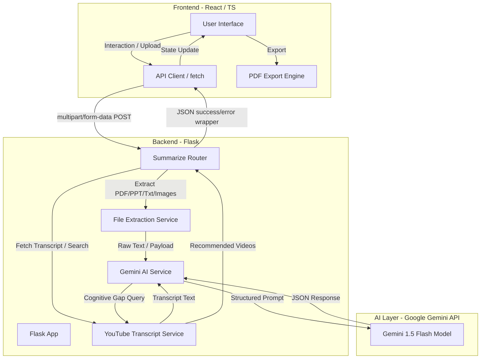

# Project Architecture & Pipelines

This document provides a detailed technical breakdown of the system architecture, data pipelines, and AI engines driving the **AI-Based Intelligent Notes Summarizer & Learning Assistant**.

---

## 1. System Architecture Diagram

The application is structured as a decoupled full-stack application following a client-server paradigm with asynchronous capabilities:

---

## 2. Ingestion & Processing Pipelines

The system ingests content from three primary channels: uploaded documents/images, pasted raw text, or YouTube video URLs.

### A. Document Ingestion Pipeline (PDF, PPTX, TXT)
1. **Validation**: The backend verifies the file extension against the allowed set: `.pdf`, `.pptx`, `.txt`, `.png`, `.jpg`, `.jpeg`, `.webp`. It enforces a maximum request size limit of **50MB** (configured via `MAX_CONTENT_LENGTH`).
2. **Text Extraction**:
   - **PDF Processing**: Utilizes `PyPDF2.PdfReader` to parse pages sequentially. It extracts text from each page stream and accumulates it into a consolidated string buffer. If individual pages fail, they are logged and skipped to avoid failing the entire extraction.
   - **PPTX Processing**: Uses the `pptx` package (`Presentation`) to iterate through presentation slides and shape structures. It extracts slide text content, maintaining visual read ordering slide-by-slide.
   - **TXT Processing**: Directly decodes files as standard UTF-8 text streams.

### B. OCR Ingestion Pipeline (Images)
1. **Image Validation**: Reads file streams and opens them using Pillow (`PIL.Image`).
2. **Multimodal Extraction**: Instead of standard localized OCR tools (e.g. Tesseract) which lack context, the image is passed directly to the **Gemini 1.5 Flash** model. Gemini performs simultaneous text extraction (multimodal OCR) and summarization, ensuring that diagrams and textual layouts are contextualized correctly.

### C. YouTube Video Transcript Pipeline
1. **URL Parsing**: Extract video IDs using standard regular expressions:
   - Matches standard watch URLs (`youtube.com/watch?v=VIDEO_ID`)
   - Matches short URLs (`youtu.be/VIDEO_ID`)
   - Matches embedded video frames (`youtube.com/embed/VIDEO_ID`)
2. **Transcript Retrieval**: Uses `youtube-transcript-api` to query transcripts.
   - It performs localized searches prioritizing regional languages (e.g., Telugu, Hindi, English).
   - If standard regional language transcripts are unavailable, it falls back to the first available language track or auto-generated English captions.
3. **Chunking**: Collects text arrays, joining speaker segments into a single cohesive article format.

---

## 3. Core AI Engines

### A. Summarization Engine
The summarization engine converts unstructured raw text (from transcripts or documents) into a high-density educational summary.
- **Model**: `models/gemini-2.5-flash`
- **Configuration**: `response_mime_type: "application/json"` to enforce structured JSON schema outputs.
- **Prompt Engineering**: Instructs the model to act as an expert academic tutor, breaking down the material into key concepts, lists of summaries, key statistics, historical timeline events (turning points), and key people involved.

### B. Quiz & Gap Analysis Engine
Integrated inside the summarization payload generation, this engine analyzes the text for difficult technical concepts or logical omissions.
- **Gap Detection**: Identifies 2-3 logical concepts that are prerequisite to understanding the text but are not fully explained in the source content.
- **Remediation**: For each identified gap, it creates a custom learning query (`youtube_query`) representing the best search query to learn the concept.
- **Resource Matching**: The backend takes the AI-generated `youtube_query` and queries the YouTube search API using `youtubesearchpython.VideosSearch`. It matches the query against current YouTube educational content, retrieving the title, video link, channel, and thumbnail to return to the user.
